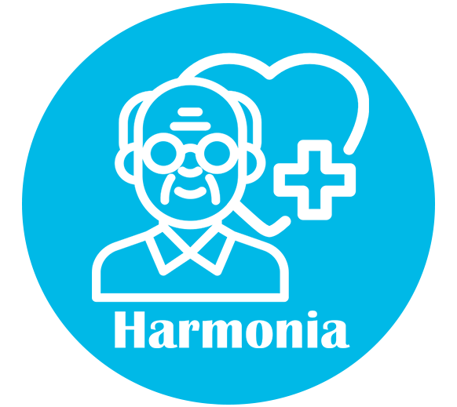

# Harmonia 🧠💙

**Empowering Alzheimer's patients with dignity and independence**

A privacy-first support app designed specifically to help individuals with Alzheimer's maintain independence while providing caregivers with peace of mind.



## 📱 About

Harmonia is a comprehensive mobile application that bridges the gap between independence and safety for Alzheimer's patients. Our app focuses on preserving dignity while ensuring security through innovative features designed with both patients and caregivers in mind.

## ✨ Key Features

### 🔔 Smart Reminders
- Gentle medication alerts and task notifications
- Voice input support for easy interaction
- Customizable reminder schedules

### 👨‍👩‍👧‍👦 Family Profiles
- Photo-based recognition system
- Helps patients remember loved ones with visual cues
- Easy-to-navigate family member directory

### 📖 Digital Journal
- Record moods, thoughts, and memories
- Support for photos, notes, and voice logs
- Track daily experiences and emotional well-being

### 🎮 Memory Games
- Engaging cognitive exercises
- Personalized with familiar faces and memories
- Designed to support mental stimulation

### ♿ Accessibility Suite
- Large, easy-to-read buttons
- Voice control functionality
- High contrast UI options
- Adjustable text sizes
- Multilingual support

### 🔒 Privacy & Security
- **100% offline operation**
- Local encrypted data storage
- No cloud database dependency
- User-controlled backups
- No data sharing with third parties

### 🆘 Emergency Features
- **Emergency SOS** - Instant contact with trusted individuals
- **Geofence Alerts** - Notifies caregivers if patient moves beyond safe zones (100m from home)
- PIN protection for sensitive settings

### 🌙 User Experience
- Light and dark mode options
- Offline functionality - works without internet
- Secure Google Drive backup (optional)
- Simple, intuitive navigation

## 🛠️ Technical Specifications

### Built With Flutter
- **Framework**: Flutter (Dart)
- **Platform**: Android (APK)
- **Target Region**: Tunisia (Africa/Tunis timezone)
- **Architecture**: Privacy-first, offline-capable mobile application

### Key Dependencies
- `shared_preferences` - App preferences and settings
- `path_provider` - Local file system access
- `csv` - CSV file parsing for data storage
- `url_launcher` - Email and web link integration
- `timezone` - Tunisia timezone support  
- Enhanced notification services for hourly wellness reminders
- Material Design 3 UI components

### Core Features
- **Hourly Wellness Notifications** - Background notification system
- **App Lifecycle Management** - Maintains notifications when app is backgrounded
- **Theme Support** - Light and dark mode with persistent preferences
- **Local Data Storage** - CSV-based storage system for all user data
- **Emergency SOS Integration** - Quick access to emergency contacts
- **File-Based Architecture** - Profile images, audio recordings stored locally
- **Email Integration** - Direct contact support via mailto links
- **Timezone Support** - Configured for Tunisia (Africa/Tunis)
- **First Launch Setup** - Automated notification configuration on initial app start

### Privacy by Design
- ✅ **100% offline operation** - All data stored locally on device
- ✅ **CSV-based local storage** - Profile, journal, and family data in CSV format
- ✅ **File system storage** - Images and audio stored in app directory
- ✅ **No cloud database** - Zero remote data transmission
- ✅ **Emergency contacts** - Stored locally, accessible via SOS button
- ✅ **User-controlled backups** - Optional local export functionality
- ✅ **No third-party data sharing** - Complete data isolation

### Accessibility Features
- ✅ Voice commands
- ✅ Clear, large UI elements
- ✅ Multilingual support
- ✅ Simple navigation
- ✅ Adjustable text sizes

## 🚀 Development Setup

### Prerequisites
- Flutter SDK (latest stable version)
- Android Studio / VS Code with Flutter extensions
- Android device or emulator for testing

### Project Structure
```
lib/
├── main.dart                          # App entry point with notification setup
├── pages/
│   ├── welcome_page.dart             # Welcome screen
│   ├── onboarding_page.dart          # First-time user setup
│   ├── home_page.dart                # Main dashboard
│   ├── splash_screen.dart            # Loading screen
│   └── content/
│       ├── reminders_page.dart       # Medication & task reminders
│       ├── journal_page.dart         # Daily mood & memory journal
│       ├── profiles_page.dart        # Family member profiles
│       ├── games_page.dart           # Memory exercises
│       ├── chat_page.dart            # Communication features
│       └── settings/                 # Configuration pages
└── services/
    └── hourly_notification_service.dart # Background notification system
```

### Getting Started
1. Clone the repository
2. Run `flutter pub get` to install dependencies
3. Connect an Android device or start an emulator
4. Run `flutter run` to launch the app
5. For release build: `flutter build apk --release`

### Data Storage Architecture
Harmonia uses a unique **CSV-based local storage system** that ensures complete privacy and data portability:

- **`profile.csv`** - User profile information (name, family details)
- **`journal_entries.csv`** - Daily mood and memory journal entries
- **`emergency.txt`** - Emergency contact information
- **`profile_image.jpg`** - User profile photo
- **Audio files** - Voice recordings stored as local files
- **App preferences** - Settings stored via SharedPreferences

This approach ensures:
- ✅ **Complete data ownership** - Users can access/export their data anytime
- ✅ **No vendor lock-in** - Standard CSV format for easy migration
- ✅ **Offline reliability** - No internet dependency for core functionality
- ✅ **Privacy protection** - No cloud uploads or third-party access

### Key Features Implementation
- **Hourly Notifications**: Enhanced background service with app lifecycle management
- **Theme Switching**: Dynamic light/dark mode with persistent preferences
- **Timezone Support**: Configured for Tunisia (Africa/Tunis)
- **First Launch Setup**: Automatic notification configuration on initial app start

## 📥 Installation

### Download Options

1. **Direct Download**: [Download APK](https://drive.google.com/file/d/1OsRNWXsDYrIwictacD5pFdjwMN3noyxj/view?usp=drive_link)
2. **QR Code**: Scan the QR code from our website

### Installation Steps

1. Download the APK file from the link above
2. Open your Downloads folder and tap the APK file
3. If installation is blocked:
   - Go to **Settings → Security**
   - Enable "Install unknown apps" or "Unknown sources"
4. Follow the installation prompts
5. Launch Harmonia and begin setup

## 💬 What Families Are Saying

> *"Harmonia has been a game-changer for my father. The photo recognition feature helps him remember us even on difficult days, and the reminders ensure he takes his medication on time. As a caregiver, the peace of mind is priceless."*
> 
> **— Sarah Johnson, Daughter of Alzheimer's Patient**

> *"The simple interface means my wife can use it independently. She enjoys the memory games with our family photos, and I appreciate the alerts if she wanders beyond our neighborhood. It respects her dignity while keeping her safe."*
> 
> **— Michael Chen, Husband and Caregiver**

## 👥 Development Team

- **Adem Youssfi** - Team Leader and Developer
- **Chaima Dhouibi** - Designer and Developer  
- **Ayhem Belhassen** - Developer and Tester

## 📞 Contact & Support

- **Email**: [ademyoussfi57@gmail.com](mailto:ademyoussfi57@gmail.com)
- **Support**: For technical support and feature requests, please contact us via email

## 🎯 Mission

Our mission is to create technology that enhances the quality of life for Alzheimer's patients and their families while maintaining privacy, dignity, and independence. Harmonia represents our commitment to accessible, secure, and user-friendly healthcare technology.

## 📄 License

© 2025 Harmonia Development Team. All rights reserved.

---

**Made with ❤️ for families affected by Alzheimer's**